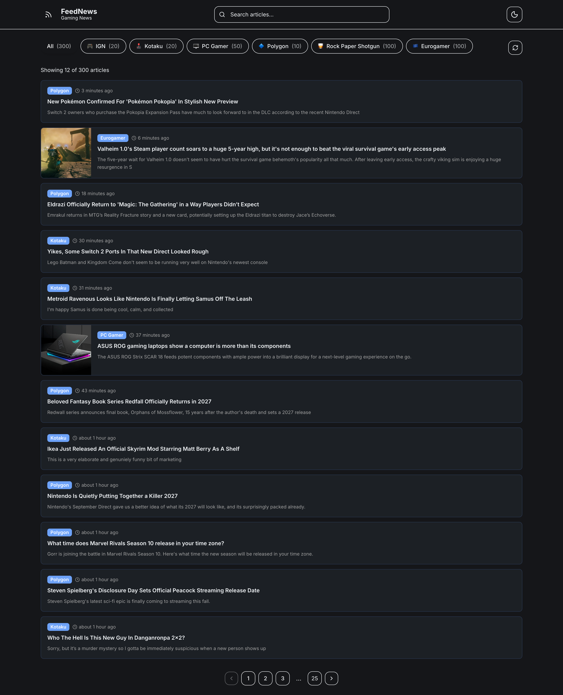
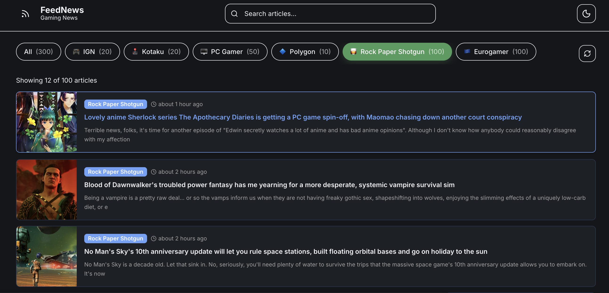
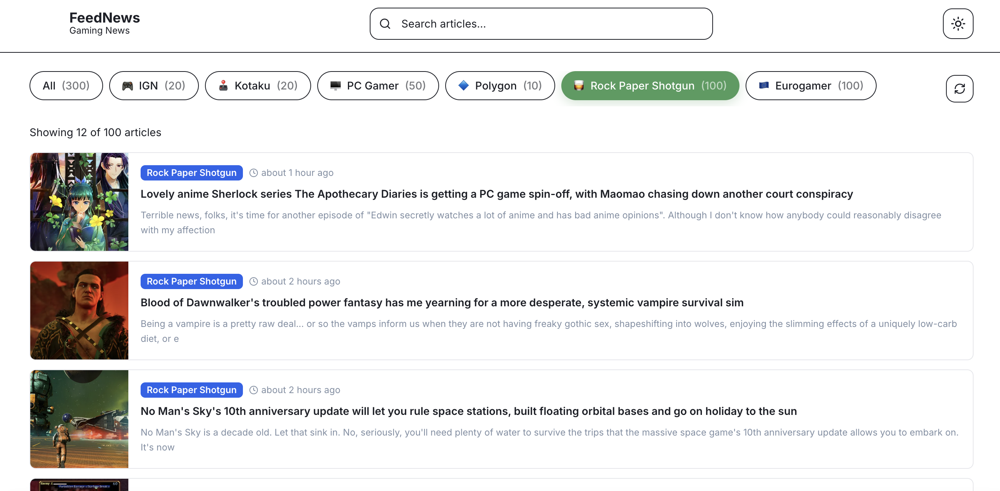

# FeedNews — Gaming News Aggregator

FeedNews is a full-stack Next.js application that aggregates the latest gaming news from six major outlets — IGN, Kotaku, PC Gamer, Polygon, Rock Paper Shotgun, and Eurogamer — into a single, searchable, filterable feed.

It is a single Next.js (App Router) project where the server and the client live together: a JSON API route parses and normalizes each outlet's RSS feed, and a React client consumes that API to render the aggregated feed with search, per-source filtering, and pagination.

## Goal

The main goal of this project is to practice building a real content-aggregation application in Next.js: fetching and normalizing external data on the server, exposing it through a typed JSON API, and managing that data on the client with a robust data-fetching strategy.

Beyond building the feed itself, the project explores how the server and the client share contracts and state:

| Concern | How it is handled |
| --- | --- |
| Data contract | The `Article` interface in `src/types/index.ts` defines the normalized shape shared by the API and the UI. |
| Feed normalization | `rss-parser` reads heterogeneous RSS feeds and normalizes them into a single `Article` shape (title, link, description, image, pubDate, source). |
| Image extraction | A cascade in `src/lib/parser.ts` tries `enclosure`, `media:thumbnail`, `media:content`, then the first `` inside the content. |
| Server state | SWR drives loading/error/success states with a 5-minute refresh interval, manual refresh, and cache-friendly revalidation. |
| Resilience | `Promise.allSettled` fetches every source in parallel — a single failing outlet does not break the feed; per-source errors are collected and reported. |
| Rendering strategy | Hybrid approach: SSG for per-source pages, ISR (300s) for the home feed, and a dynamic API route for on-demand data. |

## Learning objectives

- Use the Next.js App Router: routing, layouts, server/client components, route handlers, and API routes.
- Compare rendering strategies — SSG, ISR, and dynamic routes — and apply them appropriately.
- Parse and normalize external RSS/XML data and handle unreliable third-party feeds gracefully.
- Design a typed JSON API (`/api/feed`) with query parameters and consistent error handling.
- Manage client-side server state with SWR (polling, mutation, cache invalidation).
- Implement client-side search, filtering, and pagination over a server-provided dataset.
- Build a themeable UI with Tailwind CSS and CSS variables (light/dark).

## Tech Stack

### Server
- Next.js 16 (App Router, Turbopack)
- rss-parser
- TypeScript

### Client
- React 19
- Tailwind CSS
- SWR
- next-themes
- date-fns
- lucide-react
- clsx + tailwind-merge

## Project Structure

```
feed-newsapi/
├── src/
│   ├── app/
│   │   ├── api/feed/route.ts        # RSS aggregation API route
│   │   ├── source/[slug]/page.tsx   # Per-source page (SSG)
│   │   ├── globals.css              # Design tokens (light/dark)
│   │   ├── layout.tsx               # Root layout + theme provider
│   │   └── page.tsx                 # Home — all feeds
│   ├── components/
│   │   ├── article-card.tsx         # Article card with thumbnail + metadata
│   │   ├── feed-page.tsx            # Main feed (all sources)
│   │   ├── header.tsx               # Logo, search, theme toggle
│   │   ├── loading-skeleton.tsx     # Skeleton loader
│   │   ├── pagination.tsx           # Windowed pagination controls
│   │   ├── source-filter.tsx        # Per-source filter with counts
│   │   └── source-page.tsx          # Single-source feed
│   ├── lib/
│   │   ├── parser.ts                # RSS parsing + article normalization
│   │   ├── sources.ts               # Source registry
│   │   └── utils.ts                 # cn() helper
│   └── types/
│       └── index.ts                 # Article / FeedResponse contracts
├── src/assets/                      # README screenshots
├── eslint.config.mjs
├── next.config.ts
├── package.json
├── postcss.config.mjs
├── tailwind.config.cjs
└── tsconfig.json
```

## Running Locally

Requirements: Node.js ≥ 20.9 (e.g., via nvm).

```bash
npm install
npm run dev
```

Open [http://localhost:3000](http://localhost:3000) with your browser to see the feed.

| Command | Description |
| --- | --- |
| `npm run dev` | Start the dev server (Turbopack) |
| `npm run build` | Production build |
| `npm start` | Start the production server |
| `npm run lint` | Run ESLint |

## Screenshots

Home feed



Home feed (dark theme)



Home feed (light theme)



## Features

### Server
- `/api/feed` route handler — returns all articles, or a single source via `?source=<slug>`.
- Normalization of heterogeneous RSS feeds into a shared `Article` contract.
- Image extraction cascade with HTML-content fallback.
- HTML sanitization of descriptions (tags stripped, entities decoded, 200-char limit).
- Parallel fetching with per-source error isolation (`Promise.allSettled`).
- SSG + ISR: per-source pages pre-rendered, home revalidated every 5 minutes.

### Client
- Search across titles and descriptions (case-insensitive).
- Per-source filtering with live article counts.
- Pagination, 12 articles per page, with windowed page numbers and ellipsis.
- Article cards with lazy-loaded thumbnails (hidden on error), source badge, and relative timestamps.
- Loading skeletons, error state, and empty state.
- Stale-while-revalidate with an opacity indicator during background refresh.
- Light/dark theme via `next-themes` (defaults to dark, follows the system).

## Learning Journey

Development notes and technical decisions will be documented here as the project evolves.